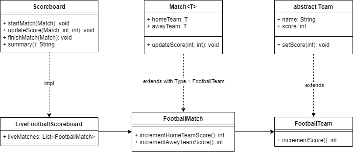

# Live Football World Cup Score Board
***Live Football World Cup Scoreboard library that shows all the ongoing matches and their scores***

### Requirements
#### The scoreboard supports the following operations:
1. Start a new match, assuming initial score 0 – 0 and adding it the scoreboard. This should capture following parameters: a. Home team b. Away team
2. Update score. This should receive a pair of absolute scores: home team score and away team score.
3. Finish match currently in progress. This removes a match from the scoreboard.
4. Get a summary of matches in progress ordered by their total score. The matches with the same total score will be returned ordered by the most recently started match in the scoreboard.

### UML Diagram

### Assumptions
1. I've decided to add increment methods to Match and Team implementations, 
because some games have a rule of "incrementational" way of updating a score
(for example Football scores are always changed by +1). 
These methods are not used in LiveFootballScoreboard, because there is no such requirement, 
but could be used by another custom Scoreboard implementation.
2. I've added a score field to Team class, as IMHO it is kind of similar to a current state,
but it also could be in Match class, like homeTeamScore and awayTeamScore fields, 
or even another object of class Score that contains homeTeamScore and awayTeamScore fields.
3. I've added a getter method to liveMatches field for easier testing, but I am not sure
that in such case it is okay to have a possibility to address liveMatches field directly.
IMHO It is better to make liveMatches immutable and remain getter.